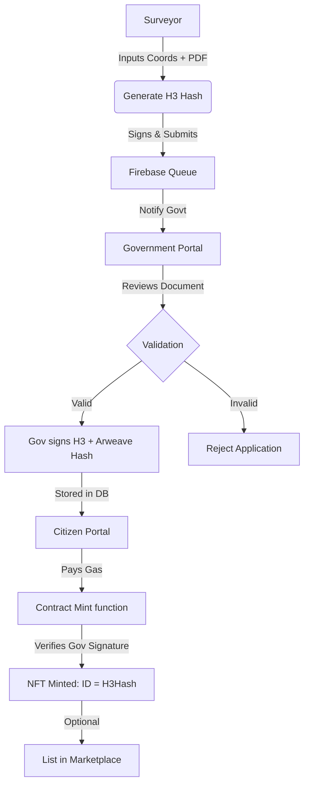

# 🌍 Decentralized Land Registry (LandRegistry)

[](https://hardhat.org/)
[](https://soliditylang.org/)
[](https://vitejs.dev/)
[](https://openzeppelin.com/)

A premium, end-to-end decentralized solution for land ownership management. This project replaces traditional, paper-based bureaucratic systems with a cryptographic "Judge" model, ensuring immutable records, geospatial uniqueness, and a seamless marketplace experience.

---

## 💎 Project Philosophy: "Law as Code"

Traditional land registries are rife with fraud and inefficiency. **LandRegistry** solves this by:
1.  **Mathematical Identity**: Using Uber's **H3 Geospatial Index** to verify that no two parcels overlap.
2.  **The Judge Model**: Government officials act as cryptographic signers, authorizing minting only after legal document verification.
3.  **H3-as-ID Enforcement**: Your NFT's `TokenID` **is** the H3 Geohash. The ID itself is proof of location.

---

## 🚀 Key Features

### 🏢 Three-Portal Workflow
*   **Surveyor Portal**: Professional surveyors input exact boundaries and upload legal deeds (PDF) to Arweave.
*   **Government Portal**: Officials review documents, verify surveyor credentials, and provide a cryptographic "green light."
*   **Citizen Portal**: Owners mint their verified land as NFTs and list them on a global, permissionless marketplace.

### 🛰️ Advanced Geospatial Tech
*   **H3 Indexing (Res 9)**: Converts complex polygons into deterministic hexagonal cells.
*   **Collision Prevention**: The contract prevents duplicate minting of the same H3 hash at the protocol level.

### 🎨 Premium Aesthetics
*   **Modern Typography**: Styled with **Space Grotesk** for headlines and **Open Sans** for interface clarity.
*   **Dynamic UI**: Glassmorphism cards, micro-animations, and real-time upload feedback.
*   **Lucide-React integration**: High-quality iconography for a professional "Gov-Tech" feel.

---

## 🛠️ Technology Stack

### Smart Contract
- **Solidity 0.8.20**: Modern, gas-optimized code.
- **OpenZeppelin V5**: Using `ERC721URIStorage`, `Ownable`, and `ReentrancyGuard`.
- **ECDSA Verification**: Secure off-chain signature handling via `MessageHashUtils`.

### Frontend
- **React + Vite**: Lightning-fast development and optimized production builds.
- **Tailwind CSS**: Custom design system with glassmorphism and modern color palettes.
- **Ethers.js v6**: The latest blockchain interaction layer.
- **Firebase Firestore**: Real-time state management between portals.

---

## 📖 How It Works (Step-by-Step)



---

## ⚡ Quickstart

### 1. Prerequisites
- Node.js v18+
- MetaMask Wallet
- Firebase Project

### 2. Installations
```bash
# Clone the repository
git clone https://github.com/Gowthamancit/Working-land-registry.git
cd "land Registry"

# Install root dependencies (Hardhat)
npm install

# Install frontend dependencies
cd frontend
npm install
```

### 3. Environment Configuration
Create a `.env` in the root:
```env
PRIVATE_KEY=your_private_key
GOVERNMENT_ADDRESS=0x...
SEPOLIA_RPC_URL=...
ETHERSCAN_API_KEY=...
```

Create a `.env` in `/frontend`:
```env
VITE_FIREBASE_API_KEY=...
VITE_FIREBASE_PROJECT_ID=...
# ... other firebase vars
```

### 4. Deployment
```bash
# From the root
npx hardhat run scripts/deploy.js --network sepolia
```

---

## 🧠 Contract Architecture

### `LandRegistry.sol`
*   **`mint(bytes32 h3Hash, string arweaveHash, bytes govSign)`**: The core function that uses `ecrecover` to verify the "Judge's" approval.
*   **`getAllMintedTokens()`**: Discovery helper for fetching non-sequential IDs.
*   **`listings` mapping**: Integrated marketplace logic with fractional ETH support.

---

## 🚧 Status & Roadmap
- [x] Integrate H3-ID system.
- [x] Implement glassmorphism UI.
- [x] Add real-time document upload feedback.
- [ ] Add interactive MapView for the Citizen Portal.
- [ ] Implement secondary market royalty logic.

---

## 🤝 Contributing
We welcome contributions! Please fork the repo and submit a PR. For major changes, please open an issue first to discuss what you would like to change.

## 📄 License
[MIT](https://choosealicense.com/licenses/mit/)

---

**Crafted with precision for the future of decentralized governance.**
